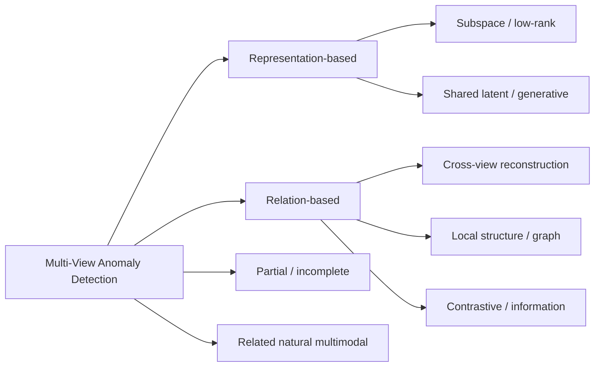

# Awesome Multi-View Anomaly Detection

> A curated paper list, taxonomy, benchmark map, dataset registry, protocol guide, and reproducibility-oriented knowledge base for **Multi-View Anomaly/Outlier Detection (MVOD)**.

**Keywords:** multi-view anomaly detection · multi-view outlier detection · cross-view consistency · multimodal anomaly detection · partial multi-view

> Accuracy comes before coverage. A missing paper is preferable to a fabricated venue, code repository, or benchmark claim.

## News

- **2026-08-27:** Initial public-ready registry, controlled vocabulary, protocol map, generators, and validation workflow created.

## What do we mean by MVOD?

The name is overloaded. This repository keeps three settings visibly separate:

| Track | Observations | Main question | Benchmark compatibility |
|---|---|---|---|
| **CORE: classical MVOD** | The same instance has two or more aligned feature views, \(x_i^{(1)},\ldots,x_i^{(V)}\). | Is the instance unusual within views, inconsistent across views, or both? | Main registry and classical benchmark map |
| **PARTIAL / INCOMPLETE MVOD** | Aligned instances exist, but one or more views are missing for some instances. | Can cross-view evidence remain reliable under missingness? | Separate track; missingness is part of the protocol |
| **RELATED: natural multimodal / multi-view AD** | RGB–depth, RGB–point cloud, multiple cameras, or sensors observe a physical object or scene. | Is there a natural defect or semantic anomaly, possibly localized in space? | **Not pooled** with classical synthetic MVOD results |

This repository uses **MVOD** as the umbrella term and treats classical aligned-instance outlier detection as its core. “MVAD” in a paper title does not by itself determine the track—the data model and evaluation protocol do.

## Scope

A core paper must use at least two aligned views/modalities, make anomaly or outlier detection a primary task, and explicitly exploit cross-view relations. Single-view AD, ordinary multi-view clustering, ordinary multimodal classification, and systems that merely ensemble multiple backbones are excluded. Borderline works are retained only under `track: uncertain`.

No private reproduction results, unpublished methods, local paths, or internal audits are part of this public repository.

## Table of Contents

- [Getting Started](#-getting-started)
- [Recent Research](#-recent-mvod-research)
- [Paper Tree](#-paper-tree)
- [Timeline](#-timeline)
- [Method Taxonomy](#-method-taxonomy)
- [Anomaly Taxonomy](#-anomaly-taxonomy)
- [Paper List](#-paper-list)
- [Benchmarks](#-benchmarks)
- [Datasets](#-datasets)
- [Protocols](#-protocols)
- [Reproducibility](#-reproducibility)
- [Resources](#-resources)
- [Contributing](#contributing)

## 🚀 Getting Started

1. Learn why “attribute”, “class”, and “mixed” do not imply a universal corruption recipe in [Anomaly Taxonomy](docs/ANOMALY_TAXONOMY.md).
2. Use the [Paper Tree](docs/PAPER_TREE.md) to locate the source of anomaly evidence.
3. Follow the [recommended reading path](#recommended-reading-path), then inspect the complete [paper registry](docs/PAPERS.md).
4. Before comparing numbers, read [Protocols](docs/PROTOCOLS.md) and [Datasets](docs/DATASETS.md).
5. For a new study, choose defensible comparisons using the [Baseline Map](docs/BASELINE_MAP.md).

## 🔥 Recent MVOD Research

Only years and venues with verified entries are shown. An arXiv year is not silently promoted to a conference year.

<!-- AUTO-GENERATED: RECENT START -->
### 2026

**AAAI**
- **SCoNE: Spherical Consistent Neighborhoods Ensemble for Effective and Efficient Multi-View Anomaly Detection** [[paper]](https://doi.org/10.1609/AAAI.V40I19.38643)

**Applied Intelligence**
- **Multi-view outlier detection via tensor decomposition and information decoupling** [[paper]](https://doi.org/10.1007/s10489-026-07375-y) [[code]](https://github.com/YF-W/MOD-TDID)

**ECCV**
- **IMMoE: Incomplete Multi-View Anomaly Detection via Mixture of View Experts Fusion** (accepted; proceedings not yet verified) [[paper]](https://arxiv.org/abs/2607.19032) [[code]](https://github.com/HULEI7/IMMoE)

**ICASSP**
- **Bilateral Graph Filtering Framework with Alternating Optimization for Robust Multi-View Outlier Detection** [[paper]](https://doi.org/10.1109/ICASSP55912.2026.11460482)
- **Granular-Ball Based Multi-View Outlier Detection** [[paper]](https://doi.org/10.1109/ICASSP55912.2026.11462415)

**IEEE Transactions on Multimedia**
- **Learning Multi-View Anomaly Detection With Efficient Adaptive Selection** [[paper]](https://doi.org/10.1109/TMM.2026.3660076)

**arXiv**
- **MATCH: Flow Matching for Multi-View Anomaly Detection** (preprint) [[paper]](https://arxiv.org/abs/2606.24375)
- **SGANet: Semantic and Geometric Alignment for Multimodal Multi-view Anomaly Detection** (preprint) [[paper]](https://arxiv.org/abs/2604.05632)

### 2025

**AAAI**
- **Unveiling Multi-View Anomaly Detection: Intra-view Decoupling and Inter-view Fusion** [[paper]](https://doi.org/10.1609/AAAI.V39I12.33349) [[code]](https://github.com/Kerio99/IDIF)

**CVPR Workshops**
- **Multi-Flow: Multi-View-Enriched Normalizing Flows for Industrial Anomaly Detection** [[paper]](https://doi.org/10.1109/CVPRW67362.2025.00378)

**ICASSP**
- **Unsupervised Multi-View Outlier Detection via Optimal Graph Filtering** [[paper]](https://doi.org/10.1109/ICASSP49660.2025.10889803)

**Information Fusion**
- **Low-rank Tucker decomposition for multi-view outlier detection based on meta-learning** [[paper]](https://doi.org/10.1016/j.inffus.2025.103313)

**International Journal of Approximate Reasoning**
- **Multi-view outlier detection based on multi-granularity fusion of fuzzy rough granules** [[paper]](https://doi.org/10.1016/j.ijar.2025.109402) [[code]](https://github.com/YF-W/MGFMOD)

### 2024

**ACM MM**
- **Regularized Contrastive Partial Multi-view Outlier Detection** [[paper]](https://doi.org/10.1145/3664647.3681125)

**ACM TKDD**
- **Information-aware Multi-view Outlier Detection** [[paper]](https://doi.org/10.1145/3638354) [[code]](https://github.com/GTML-LAB/IAMOD)

**ECCV**
- **Learning Diffusion Models for Multi-view Anomaly Detection** [[paper]](https://doi.org/10.1007/978-3-031-73414-4_19) [[code]](https://github.com/jayliu0313/Diffusion_Multi-View_AD)

**Information Fusion**
- **Multi-view Outlier Detection via Graphs Denoising** [[paper]](https://doi.org/10.1016/j.inffus.2023.102012) [[code]](http://Doctor-Nobody.github.io/codes/MODGD.zip)

**Multimedia Systems**
- **Multi-view anomaly detection via hybrid instance-neighborhood aligning and cross-view reasoning** [[paper]](https://doi.org/10.1007/s00530-024-01526-2) [[code]](https://github.com/tl-git320/INA-CR)

**PAKDD**
- **SeeM: A Shared Latent Variable Model for Unsupervised Multi-view Anomaly Detection** [[paper]](https://doi.org/10.1007/978-981-97-2242-6_7) [[code]](https://github.com/thanhphuong163/SeeM)
<!-- AUTO-GENERATED: RECENT END -->

## 🌳 Paper Tree

The tree is derived **after** registry tagging and is maintained as Mermaid source: [full paper tree](docs/PAPER_TREE.md). It separates representation evidence, relational evidence, partial views, and natural multimodal AD rather than forcing every paper into “deep/non-deep”.

## 🕒 Timeline

The compact evolution is: early cluster and cross-view inconsistency models → low-rank/shared representations → local-neighborhood and deep reconstruction → probabilistic, contrastive, information-aware, graph-filtered, and partial-view models. See the evidence-qualified [Timeline](docs/TIMELINE.md); it is representative, not exhaustive.

## 🧠 Method Taxonomy

The primary question is: **where does anomaly evidence come from?**

- Cluster or consensus disagreement
- Subspace, low-rank, and self-representation residuals
- Shared latent, shared/private, and probabilistic generative evidence
- Cross-view mapping or reconstruction error
- Local-neighborhood, graph, and high-order/tensor consistency
- Contrastive and information-theoretic objectives
- Partial-view relation transfer or missing-view modeling
- Natural multimodal spatial, semantic, or geometric alignment (related track)

Papers may have multiple tags. Definitions and boundary decisions are in [Method Taxonomy](docs/METHOD_TAXONOMY.md).

## 🚨 Anomaly Taxonomy

- **Attribute anomaly:** unusual within-view features; some protocols perturb or replace features.
- **Class anomaly:** individually plausible views form an incompatible cross-view pairing.
- **Mixed / class-attribute anomaly:** both signals are introduced.
- **Generic multi-view outlier:** the paper does not commit to the above synthetic taxonomy.
- **Natural anomaly:** a real defect or abnormal event in the related multimodal track.

> Different MVOD papers use related terminology but may implement different anomaly-generation protocols.

See [Anomaly Taxonomy](docs/ANOMALY_TAXONOMY.md) and [Evidence Levels](docs/EVIDENCE_LEVELS.md).

## 📚 Paper List

This is a representative subset. The complete generated list is in [docs/PAPERS.md](docs/PAPERS.md), and full metadata/evidence is in [data/papers.yaml](data/papers.yaml).

<!-- AUTO-GENERATED: PAPERS START -->
| Year | Method | Venue | Mechanism | Anomaly | Code |
|---:|---|---|---|---|---|
| 2026 | [MVAS](https://doi.org/10.1109/TMM.2026.3660076) | IEEE Transactions on Multimedia | local structure, shared latent | N | — |
| 2026 | [MOD-TDID](https://doi.org/10.1007/s10489-026-07375-y) | Applied Intelligence | tensor, graph | A/C/M | [official](https://github.com/YF-W/MOD-TDID) |
| 2026 | [SCoNE](https://doi.org/10.1609/AAAI.V40I19.38643) | AAAI | local structure, ensemble | G/C | — |
| 2025 | [LRTDM](https://doi.org/10.1016/j.inffus.2025.103313) | Information Fusion | tensor, low rank | A/C/M | — |
| 2025 | [MGFMOD](https://doi.org/10.1016/j.ijar.2025.109402) | International Journal of Approximate Reasoning | local structure, probabilistic neighborhood | A/C | [official](https://github.com/YF-W/MGFMOD) |
| 2025 | [MODGF](https://doi.org/10.1109/ICASSP49660.2025.10889803) | ICASSP | graph, local structure | G/C | — |
| 2025 | [IDIF](https://doi.org/10.1609/AAAI.V39I12.33349) | AAAI | shared private, information theoretic | N | [official](https://github.com/Kerio99/IDIF) |
| 2024 | [IAMOD](https://doi.org/10.1145/3638354) | ACM TKDD | information theoretic, shared latent | A/C/M | [official](https://github.com/GTML-LAB/IAMOD) |
| 2024 | [Learning Diffusion Models for Multi-view Anomaly Detection](https://doi.org/10.1007/978-3-031-73414-4_19) | ECCV | diffusion, shared latent | N | [official](https://github.com/jayliu0313/Diffusion_Multi-View_AD) |
| 2024 | [MODGD](https://doi.org/10.1016/j.inffus.2023.102012) | Information Fusion | graph, local structure | A/C/M | [official](http://Doctor-Nobody.github.io/codes/MODGD.zip) |
| 2024 | [RCPMOD](https://doi.org/10.1145/3664647.3681125) | ACM MM | partial view, contrastive | A/C/M | — |
| 2024 | [SeeM](https://doi.org/10.1007/978-981-97-2242-6_7) | PAKDD | generative, shared latent | G/C | [official](https://github.com/thanhphuong163/SeeM) |
| 2023 | [SRLSP](https://doi.org/10.1145/3532191) | ACM TKDD | self representation, local structure | A/C/M | [official](https://github.com/wy54224/SRLSP) |
| 2023 | [dPoE](https://doi.org/10.1145/3581783.3612487) | ACM MM | generative, shared private | A/C/M | [official](https://github.com/cshaowang/dPoE) |
| 2022 | [FMOD](https://doi.org/10.1109/TBDATA.2020.3004057) | IEEE Transactions on Big Data | subspace, low rank | A/C/M | — |
| 2021 | [CGAEs](https://doi.org/10.1109/ICTAI52525.2021.00218) | ICTAI | reconstruction, cross view mapping | A/C | — |
| 2021 | [NCMOD](https://doi.org/10.1609/AAAI.V35I8.16873) | AAAI | reconstruction, local structure | A/C/M | [official](https://github.com/auguscl/NCMOD) |
| 2019 | [MUVAD](https://doi.org/10.1609/AAAI.V33I01.33014894) | AAAI | local structure | A/C | — |
| 2019 | [MODDIS](https://doi.org/10.1109/ICDM.2019.00136) | ICDM | shared latent, reconstruction | A/C/M | [official](https://github.com/sigerma/ICDM-2019-MODDIS) |
| 2018 | [LDSR](https://doi.org/10.1609/AAAI.V32I1.11826) | AAAI | subspace, low rank | A/C/M | [official](https://github.com/kailigo/mvod) |
| 2018 | [Partial Multi-View Outlier Detection Based on Collective Learning](https://doi.org/10.1609/AAAI.V32I1.11278) | AAAI | partial view, self representation | C | — |
| 2016 | [PLVM](https://proceedings.neurips.cc/paper/2016/hash/0f96613235062963ccde717b18f97592-Abstract.html) | NeurIPS | generative, shared latent | G/C | — |
| 2015 | [DMOD](https://www.ijcai.org/Abstract/15/572) | IJCAI | shared latent, self representation | A/C | — |
| 2015 | [MLRA](https://doi.org/10.1137/1.9781611974010.84) | SDM | low rank, subspace | A/C | [official](https://sheng-li.org/Codes/SDM15_MLRA_Code.zip) |
| 2011 | [HOAD](https://ieeexplore.ieee.org/document/6137313) | ICDM | clustering, graph | C | — |
<!-- AUTO-GENERATED: PAPERS END -->

## Recommended Reading Path

- **Foundations:** early cross-view inconsistency, robust probabilistic latent-variable MVAD, and DMOD establish the problem and anomaly semantics.
- **Representation:** MLRA, LDSR, MODDIS, and shared-latent generative models show how global representations expose inconsistency.
- **Local structure:** “Neighborhood in Locality Matters”, NCMOD, SRLSP, and graph-denoising methods move evidence toward neighborhoods and graphs.
- **Deep / contrastive / information:** CGAEs, dPoE, RCPMOD, and information-aware models show different ways to prevent naïve fusion.
- **Frontier:** use the generated 2024–2026 section, but check `venue_status` before citing a preprint as a proceedings paper.

## 🧪 Benchmarks

There is no single universally comparable MVOD leaderboard. A defensible experiment reports:

1. the exact dataset variant and preprocessing;
2. anomaly generation pseudocode, ratios, random seeds, and affected views;
3. whether models see contaminated or clean training data;
4. evaluation unit and metric definition;
5. missing-view generation for partial MVOD;
6. runtime/memory conditions for scalability claims.

See [Baseline Map](docs/BASELINE_MAP.md) and [Scalability](docs/SCALABILITY.md).

## 📊 Datasets

<!-- AUTO-GENERATED: DATASETS START -->
| Dataset | Instances | Views | Feature dimensions | Domain | Notes |
|---|---:|---:|---|---|---|
| [100Leaves](https://archive.ics.uci.edu/dataset/241/one-hundred-plant-species-leaves-data-set) | 1600 | 3 | 64/64/64 in the UCI feature files | plant leaf shape, margin, and texture | Many MVOD studies subsample or corrupt the complete UCI feature set. |
| [3Sources](http://erdos.ucd.ie/datasets/3sources.html) | 416 | 3 | variant-dependent | multilingual/news text | Article alignment and feature construction vary across redistributed benchmark files. |
| [BBCSport](http://mlg.ucd.ie/datasets/segment.html) | 544 | 2 | variant-dependent | news text | Multi-view versions use different vocabulary partitions or feature preprocessing. |
| [Caltech101](https://data.caltech.edu/records/mzrjq-6wc02) | variant-dependent | variant-dependent | variant-dependent | object images represented by multiple handcrafted or learned features | MVOD papers usually use a derived multi-feature subset; class count, sample count, and views are paper-specific. |
| [CiteSeer](https://linqs-data.soe.ucsc.edu/public/lbc/citeseer.tgz) | variant-dependent | variant-dependent | variant-dependent | scientific documents/citation network | Text, citation, and label variants differ; record the exact preprocessing when reporting a result. |
| [COIL-20](https://www.cs.columbia.edu/CAVE/software/softlib/coil-20.php) | 1440 | variant-dependent | variant-dependent | multi-angle object images | The base dataset has 72 poses per object; feature-view construction is paper-specific. |
| [Fashion-MNIST](https://github.com/zalandoresearch/fashion-mnist) | 70000 | variant-dependent | variant-dependent | clothing images represented by constructed feature views | Not inherently multi-view; views and anomaly corruption are constructed by each study. |
| [MNIST](http://yann.lecun.com/exdb/mnist/) | 70000 | variant-dependent | variant-dependent | handwritten digits represented by constructed feature views | Not inherently multi-view; view construction and sampling vary across papers. |
| [MVTec 3D-AD](https://www.mvtec.com/company/research/datasets/mvtec-3d-ad) | 4147 | 2 | RGB image and organized 3D point cloud | multimodal industrial inspection | Related RGB+3D track; modalities are spatially registered but use natural-defect protocols. |
| [NUSWIDEOBJ](https://lms.comp.nus.edu.sg/wp-content/uploads/2019/research/nuswide/NUS-WIDE.html) | variant-dependent | variant-dependent | variant-dependent | web images with visual features and tags | MVOD subsets differ in concepts, retained samples, visual descriptors, and tag features. |
| [Real-IAD](https://realiad4ad.github.io/Real-IAD/) | 150000 | 5 | image pixels | industrial multi-view images | Related natural multi-view track; protocol and metrics are not comparable to tabular classical MVOD. |
| [Reuters](https://archive.ics.uci.edu/dataset/137/reuters+21578+text+categorization+collection) | variant-dependent | variant-dependent | variant-dependent | multilingual/news text | “Reuters” denotes several incompatible multi-view constructions; never assume one canonical shape. |
<!-- AUTO-GENERATED: DATASETS END -->

## ⚙️ Protocols

“Same anomaly name” does not mean “same corruption”. View replacement, noise distribution, number of swapped views, anomaly ratio, class-pair sampling, normalization, train/test contamination, and metric computation can all differ. Start with [Protocols](docs/PROTOCOLS.md) and the cautiously named [Common Synthetic MVOD Protocols](docs/D1_D6_PROTOCOL.md).

## 🔁 Reproducibility

The registry records only observable public artifacts: official code, configs, dataset instructions, pretrained weights, environment, and license. Absence means “not found in the cited public sources”, not “the authors never released it”. See [Reproducibility](docs/REPRODUCIBILITY.md).

## 📖 Resources

- [Surveys, bibliography, and dataset resources](docs/RESOURCES.md)
- [Related areas](docs/RELATED_AREAS.md)
- [Reference repository analysis](docs/REFERENCE_REPO_ANALYSIS.md)
- [Quality audit](docs/QUALITY_AUDIT.md)

## Contributing

Corrections and carefully verified additions are welcome. Read [CONTRIBUTING.md](CONTRIBUTING.md), edit `data/papers.yaml`, use controlled tags from `data/taxonomy.yaml`, regenerate tables, and run the validator before opening a pull request.

## License

No license has been selected yet. The repository owner should choose a license appropriate for code and curated metadata before publication; see [BUILD_REPORT.md](BUILD_REPORT.md).
