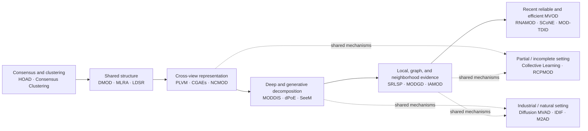

# MVOD Research Map

This is a conceptual research map, not a strict citation lineage. A method may belong to multiple families, and arrows show a change in research emphasis rather than a proven paper-to-paper dependency.

## Reading the map

1. **Consensus and clustering** ask whether views agree on group structure.
2. **Shared structure** models normal objects with common subspaces, coefficients, or low-rank components.
3. **Cross-view representation** learns a space or mapping that explains aligned views.
4. **Deep and generative decomposition** separates shared, private, and reconstruction evidence with nonlinear or probabilistic models.
5. **Local, graph, and neighborhood evidence** shifts attention from one global space to sample relations.
6. **Reliable and efficient MVOD** studies robustness to unreliable neighborhoods and the cost of complex representation learning.

Partial-view and industrial work are shown as adjacent settings because they reuse mechanisms while changing the observation model or evaluation protocol.

For full method definitions and source links, see the [Method Taxonomy](METHOD_TAXONOMY.md) and [Paper Registry](PAPERS.md).
