# Paper Tree

The tree is generated conceptually from the registry's multi-label tags. A paper can appear in more than one branch; this is a navigation aid, not a claim of mutually exclusive schools.

```mermaid
flowchart TB
  ROOT[Multi-View Anomaly / Outlier Detection]
  ROOT --> CORE[Complete-view aligned-instance MVOD]
  ROOT --> PARTIAL[Partial / incomplete MVOD]
  ROOT --> NATURAL[Related natural multimodal track]

  CORE --> REP[Representation-based evidence]
  CORE --> REL[Relation-based evidence]
  CORE --> PROB[Probabilistic / information evidence]

  REP --> SUB[Subspace / low-rank / self-representation]
  REP --> LAT[Shared latent / shared-private]
  REP --> REC[Reconstruction / generative]

  REL --> CLU[Cluster consensus]
  REL --> MAP[Cross-view mapping]
  REL --> LOC[Local neighborhood]
  REL --> GR[Graph / tensor / high-order]
  REL --> CON[Contrastive alignment]

  PROB --> PLV[Latent-variable likelihood]
  PROB --> INF[Information-theoretic fusion]
  PROB --> PNEI[Probabilistic neighborhoods / ensembles]

  PARTIAL --> COLL[Collective relation transfer]
  PARTIAL --> PCON[Contrastive partial-view learning]
  PARTIAL --> MOE[Masked or mixture-of-experts fusion]

  NATURAL --> RGBD[RGB-D / RGB-3D]
  NATURAL --> MVCAM[Multi-camera / multi-view images]
  NATURAL --> SENSOR[Multi-sensor / time-series]
```

The initial release keeps Mermaid as the source of truth and does not install a renderer solely to produce a PNG.
